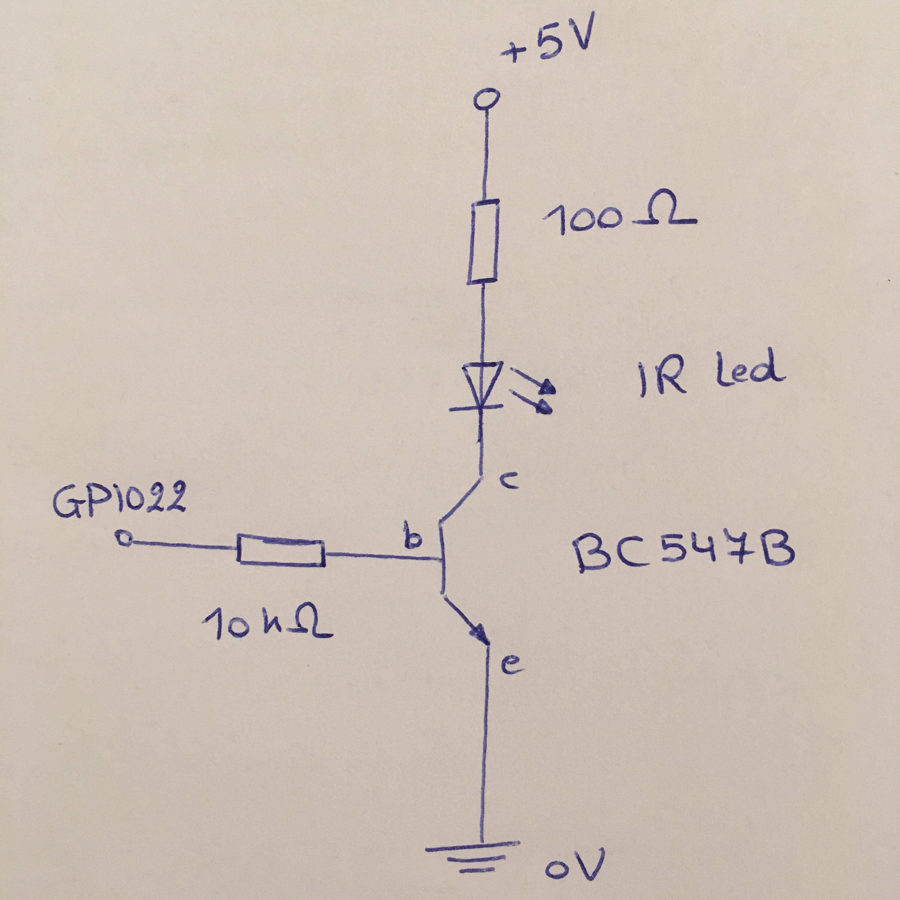
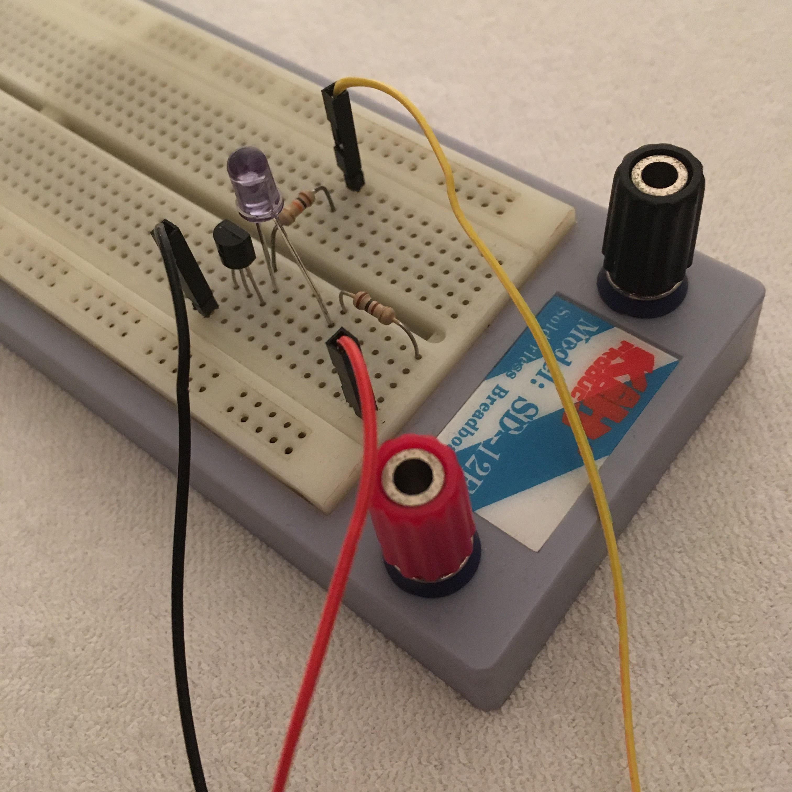
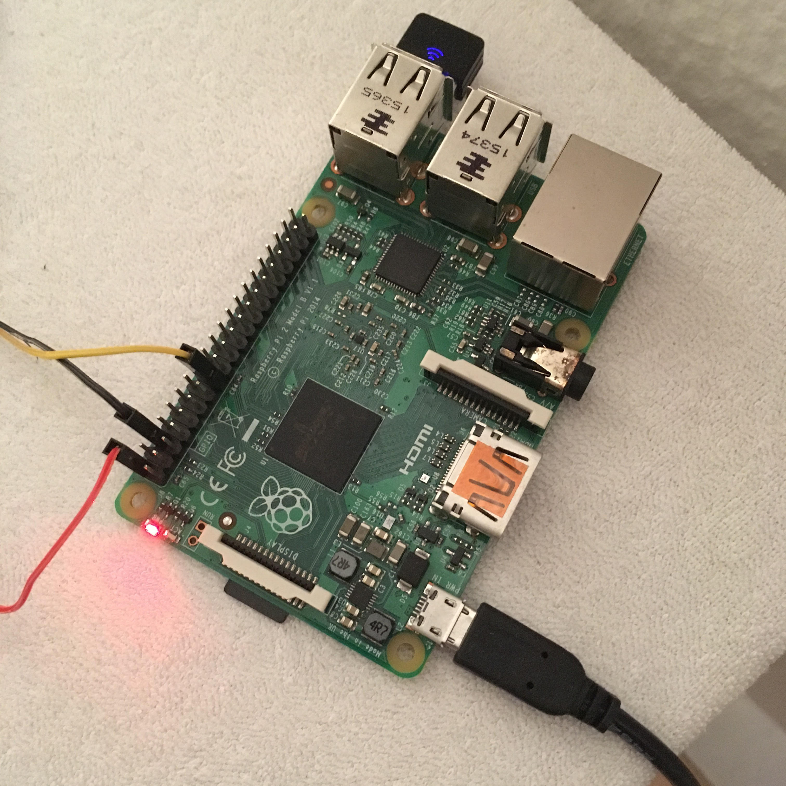
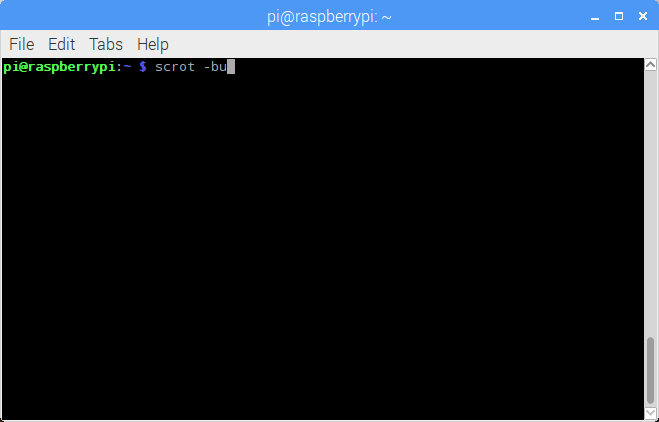
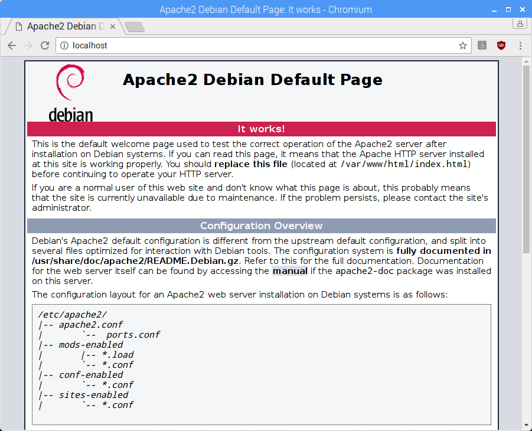
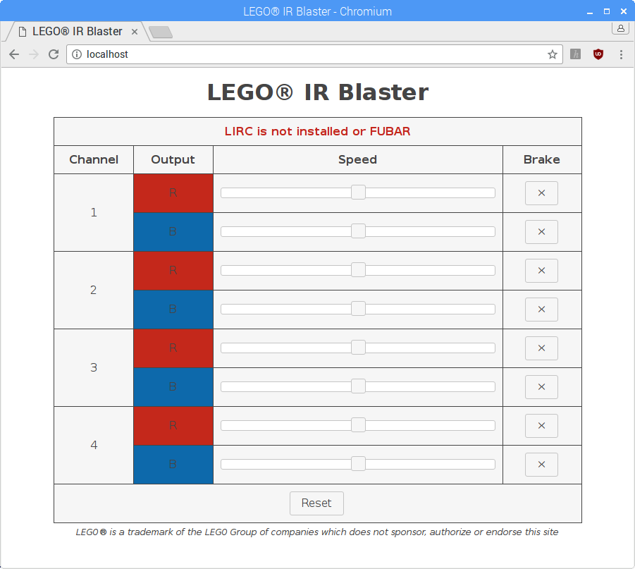
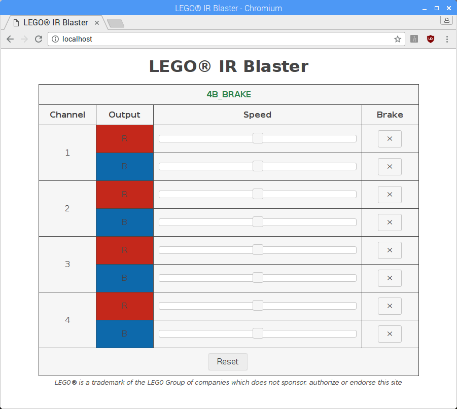

## Blast from the Past

The best present my parents ever gave me for **Sinterklaas** probably was a LEGO® train. I can't count the hours I've played with the 9V train set they gave me back then. :-)


More than 25 years have passed since then, but I have to admit that **I'm still quite fascinated by LEGO® trains today!** This fascination drove me to see if I could use everyday technology (Java, Python, JavaScript) to control them.

The result is a project that I call the **LEGO® IR Blaster:** a Python/Flask application for Raspberry Pi that gives you a web interface to control LEGO® Power Functions (trains). The web interface gives you the same control possibilities as the **LEGO® Power Functions IR Speed Remote Control 8879.**

You can find this **open source project** on [GitHub](https://github.com/braek/legoirblaster).

In this article I will explain how to build the **IR blaster hardware** and deploy the Flask application to Apache on Raspberry Pi.

## Video

This YouTube video demonstrates the **LEGO® IR Blaster** in action.

https://www.youtube-nocookie.com/embed/MxAEXKPW3xQ

## IR blaster hardware

To build an IR blaster, you need the following components, besides the Raspberry Pi:

* wires;
* breadboard;
* IR led;
* BC547B transistor;
* 10 kΩ resistor;
* 100 Ω resistor;
* multimeter for testing and measurements.

I'm using a **Raspberry Pi 2 Model B** myself, but other models might also work for this project.

Below is the hardware schema you need to build. Forgive me for the sketch. ;-)



Photo of the wiring on the breadboard:



And a photo of the Raspberry Pi wires:



That's it for the hardware for now. Let's tweak the software first.

## Prerequisites

### Terminal

Time to open up a terminal in Raspbian and follow the steps below!



### Check Raspbian version

First, make sure that you are using the correct version of Raspbian: for this tutorial I'm using **Raspbian Jessie.** I don't guarantee that the same stuff will work on lower or higher versions of Raspbian.

You can check the Raspbian version with this command:

```
pi@raspberrypi:~ $ cat /etc/os-release
PRETTY_NAME="Raspbian GNU/Linux 8 (jessie)"
NAME="Raspbian GNU/Linux"
VERSION_ID="8"
VERSION="8 (jessie)"
ID=raspbian
ID_LIKE=debian
HOME_URL="http://www.raspbian.org/"
SUPPORT_URL="http://www.raspbian.org/RaspbianForums"
BUG_REPORT_URL="http://www.raspbian.org/RaspbianBugs"
```

### Update package information

Second, make sure that your package information is up-to-date by executing the following command:

```
pi@raspberrypi:~ $ sudo apt-get update
```

### Check Python 3 version

Raspbian Jessie should have Python 3.4.2 installed by default. You can check the Python 3 version by executing the following command:

```
pi@raspberrypi:~ $ python3 --version
Python 3.4.2
```

### Install vim

The text editor **vim** is not installed by default on Raspbian. You can install **vim** with this command:

```
pi@raspberrypi:~ $ sudo apt-get install vim
```

### Install virtualenv

We need a **Python virtual environment** for this tutorial, so we need to install it with this command:

```
pi@raspberrypi:~ $ sudo apt-get install virtualenv
```

Okay, now we are good to go!

## Install Apache and deploy Flask project

First, we need to install Apache, one of the most popular web servers in the world, together with the **mod_wsgi** module to be able to deploy the Flask project to Apache through WSGI.

Install Apache and **mod_wsgi** with the following command:

```
pi@raspberrypi:~ $ sudo apt-get install apache2 libapache2-mod-wsgi-py3
```

After the installation, open a browser and surf to **http://localhost/** to see a page like this:



This is the Apache default web page and only serves as a confirmation that Apache was installed correctly.

You can check the Apache version with this command:

```
pi@raspberrypi:~ $ apache2 -v
Server version: Apache/2.4.10 (Raspbian)
Server built:   Sep 20 2017 10:24:25
```

Now we are going to disable the default settings of Apache and deploy the Flask project to it.

The default page is located in the public HTML directory. Move to this directory:

```
pi@raspberrypi:~ $ cd /var/www/html
```

Clone the Flask project (or your own fork) in this directory:

```
pi@raspberrypi:/var/www/html $ sudo git clone https://github.com/braek/legoirblaster.git
```

Make sure that the user **pi** and group **pi** are both owner of the directory:

```
pi@raspberrypi:/var/www/html $ sudo chown pi:pi legoirblaster
```

Now, move in the project directory:

```
pi@raspberrypi:/var/www/html cd legoirblaster
```

And create a new Python virtual environment:

```
pi@raspberrypi:/var/www/html/legoirblaster $ virtualenv -p python3 --no-site-packages venv
```

Activate the newly created virtual environment:

```
pi@raspberrypi:/var/www/html/legoirblaster $ source venv/bin/activate
```

The command prompt should change to something like this:

```
(venv)pi@raspberrypi:/var/www/html/legoirblaster $
```

This means that the virtual environment **venv** is activated.

Now install the Python dependencies from the **requirements.txt** file:

```
(venv)pi@raspberrypi:/var/www/html/legoirblaster $ pip install -r requirements.txt
```

Now that the dependencies are installed, you can run the **unit tests** to check the stability of the project on your machine:

```
(venv)pi@raspberrypi:/var/www/html/legoirblaster $ python -m unittest
...................................................................................................................................................
----------------------------------------------------------------------
Ran 147 tests in 0.563s

OK
```

Finally, deactivate the Python virtual environment:

```
(venv)pi@raspberrypi:/var/www/html/legoirblaster $ deactivate
```

You should see the command prompt changing back to normal:

```
pi@raspberrypi:/var/www/html/legoirblaster $
```

Move back to the home directory:

```
pi@raspberrypi:/var/www/html/legoirblaster $ cd ~
```

Now, create a new site configuration in the Apache directory:

```
pi@raspberrypi:~ $ sudo vim /etc/apache2/sites-available/legoirblaster.conf
```

And paste the following content in this file:

```
<VirtualHost *:80>
    WSGIDaemonProcess legoirblaster python-home=/var/www/html/legoirblaster/venv user=pi group=pi threads=5
    WSGIScriptAlias / /var/www/html/legoirblaster/wsgi.py
    Alias /static /var/www/html/legoirblaster/legoirblaster/static
    <Directory /var/www/html/legoirblaster>
        WSGIProcessGroup legoirblaster
        WSGIApplicationGroup %{GLOBAL}
        Require all granted
    </Directory>
</VirtualHost>
```

Disable the default Apache site:

```
pi@raspberrypi:~ $ sudo a2dissite 000-default
```

And enable the site configuration we just created:

```
pi@raspberrypi:~ $ sudo a2ensite legoirblaster
```

And finally, reload the Apache configuration:

```
pi@raspberrypi:~ $ sudo service apache2 reload
```

When you refresh the page on **http://localhost/** you should now see something like this:



You see a red message saying **"LIRC is not installed or FUBAR"** which is perfectly normal at this stage, because LIRC is not yet installed and configured.

## LIRC

First, install LIRC with this command:

```
pi@raspberrypi:~ $ sudo apt-get install lirc
```

Next, open the **/etc/modules** file:

```
pi@raspberrypi:~ $ sudo vim /etc/modules
```

And add the following lines:

```
lirc_dev
lirc_rpi
```

*Lots of tutorials and blog posts say that you need to configure the output pin here, but that is actually not necessary.*

Open the **/etc/lirc/hardware.conf** file:

```
pi@raspberrypi:~ $ sudo vim /etc/lirc/hardware.conf
```

Make sure that it contains the following key-value pairs:

```
LIRCD_ARGS="--uinput"
DRIVER="default"
DEVICE="/dev/lirc0"
MODULES="lirc_rpi"
```

Next, open the **/boot/config.txt** file:

```
pi@raspberrypi:~ $ sudo vim /boot/config.txt
```

Uncomment the following line:

```
#dtoverlay=lirc-rpi
```

And change it into:

```
dtoverlay=lirc-rpi:gpio_out_pin=22
```

*Note that the GPIO output pin is configured here instead of in the **/etc/modules** file.*

Now, open the **sudo vim /etc/lirc/lircd.conf** file:

```
pi@raspberrypi:~ $ sudo vim /etc/lirc/lircd.conf
```

To add the LEGO® IR Remote here:

```
include "/var/www/html/legoirblaster/lirc/LEGO_Single_Output.conf"
```

We are almost there, but there is still one problem that we haven't encountered yet. You need to start the LIRC device **/dev/lirc0** every time manually when the Raspberri Pi boots.

We can fix this however by opening the **/etc/rc.local** file:

```
pi@raspberrypi:~ $ sudo vim /etc/rc.local
```

And adding this line:

```
sudo lircd -d /dev/lirc0
```

Right before this line:

```
exit 0
```

Make sure that the line with the **exit** statement is still the last line of this file.

Now, reboot the Raspberry Pi:

```
pi@raspberrypi:~ $ sudo reboot
```

After reboot, open a browser and surf again to **http://localhost/** to see this screen:



As you can see: there is no longer a red message, because LIRC is now installed and configured.

If your IR blaster (hardware) is properly built and connected on the Raspberry Pi, you should now be able to control LEGO Power Functions through this web interface!

## Final words

In the future I will explore some more **3rd party solutions** to control LEGO® trains, but this was nonetheless a fun **DIY** project! :-)